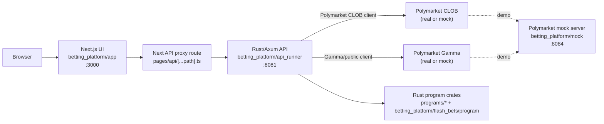
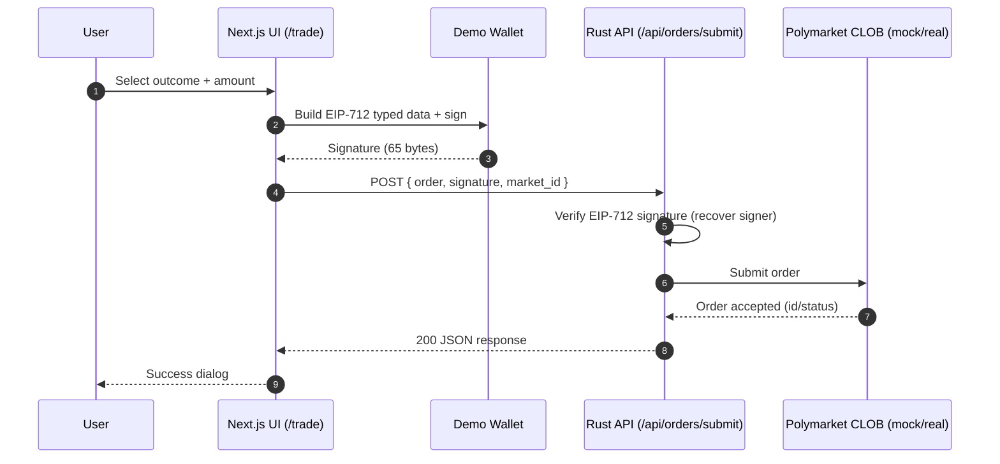
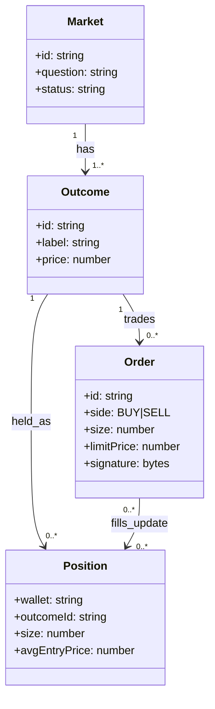
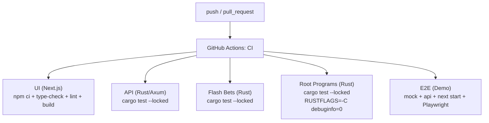
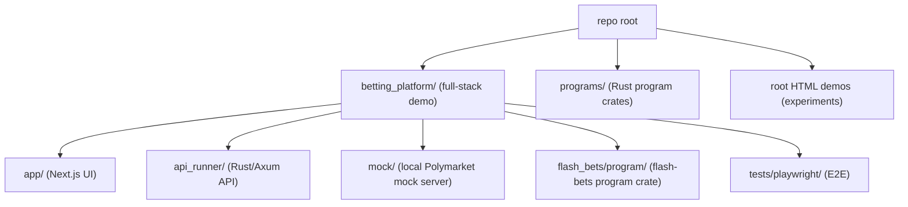

# FlashBets

[](https://github.com/gary322/flashbets/actions/workflows/ci.yml)

Demo-grade prediction market trading + "flash bets" research, packaged as a full-stack app that runs end-to-end locally and is validated in CI.

At a high level, this repo contains:
- A Next.js UI for browsing markets and placing trades (with a built-in demo wallet mode).
- A Rust/Axum API that serves market data and implements Polymarket-style order submission/status/cancel.
- A local Polymarket mock server for end-to-end demos without hitting real external services.
- Multiple Rust "program" crates (Solana-style) for verse classification, correlation, leverage safety, and state compression.
- A "flash_bets" program crate with ZK-flavored proof helpers (demo circuits) and AMM math utilities.
- Playwright E2E tests that spin up the demo stack (mock + API + UI) and validate a real trade flow.

This is intentionally a demo environment. If you want "real production" (real keys/funds, on-chain deployment, persistent DB, hard security guarantees), read `PRODUCTION_READINESS.md` first.

## Start Here

- `DEMO_INSTRUCTIONS.md`: the fastest way to run the full demo stack.
- `REPO_WALKTHROUGH.md`: where everything lives (the repo contains overlapping prototypes).
- `PRODUCTION_READINESS.md`: what would be required for a real deployment.

## Components

The repo contains multiple experiments, but these are the parts that make up the working demo stack.

| Component | Path | Tech | Purpose |
| --- | --- | --- | --- |
| UI | `betting_platform/app` | Next.js | Markets UI + trading UI + demo wallet mode |
| API | `betting_platform/api_runner` | Rust + Axum | REST API + order submission/status/cancel + integration adapters |
| Polymarket mock | `betting_platform/mock` | Node.js | Local mock of the Polymarket CLOB/Gamma endpoints for E2E |
| E2E tests | `betting_platform/tests/playwright` | Playwright | Spins up mock + API + UI and validates trade submission |
| Root programs | `programs/*` | Rust | Solana-style program crates (classification, correlation, leverage, compression) |
| Flash bets program | `betting_platform/flash_bets/program` | Rust | AMM math + demo ZK proof helpers + program tests |

## Architecture (Demo Stack)

The "source of truth" stack is under `betting_platform/`. Most other root-level HTML demos are experiments.



## What The Demo Actually Does

The demo focuses on a concrete, testable end-to-end flow:

1. UI renders a market list and lets you open a trade page.
2. Demo wallet mode "connects" a local in-browser wallet without requiring MetaMask.
3. UI builds a Polymarket-style EIP-712 order payload and signs it.
4. UI submits `POST /api/orders/submit` (via the Next proxy).
5. API verifies the signature and forwards the order to the Polymarket client.
6. In demo mode, the Polymarket client points at the local mock server.
7. The UI shows a success dialog; Playwright asserts the request/response flow.

## Quickstart (Local Demo)

Prereqs:
- Node `20` (see `.nvmrc`)
- Rust stable toolchain

Ports:
- UI: `http://127.0.0.1:3000`
- API: `http://127.0.0.1:8081`
- Polymarket mock: `http://127.0.0.1:8084`

### 1. Start Polymarket mock

```bash
node betting_platform/mock/polymarket_mock_server.js
```

### 2. Start the API (configured for the mock)

```bash
cd betting_platform/api_runner
POLYMARKET_ENABLED=true \
POLYMARKET_CLOB_BASE_URL=http://127.0.0.1:8084 \
POLYMARKET_GAMMA_BASE_URL=http://127.0.0.1:8084 \
POLYMARKET_API_KEY=demo-key \
POLYMARKET_API_SECRET=ZHVtbXktc2VjcmV0 \
POLYMARKET_API_PASSPHRASE=demo-pass \
CACHE_ENABLED=false \
QUEUE_ENABLED=false \
cargo run --release
```

### 3. Start the UI (demo wallet mode)

Important: `NEXT_PUBLIC_DEMO_WALLET_ENABLED` is a build-time flag for `next build`/`next start`.

Dev mode:
```bash
cd betting_platform/app
npm ci
NEXT_PUBLIC_DEMO_WALLET_ENABLED=true \
API_PROXY_TARGET=http://127.0.0.1:8081 \
npm run dev -- -p 3000
```

CI-like production mode (`next start`):
```bash
cd betting_platform/app
npm ci
NEXT_PUBLIC_DEMO_WALLET_ENABLED=true npm run build
PORT=3000 API_PROXY_TARGET=http://127.0.0.1:8081 NEXT_PUBLIC_DEMO_WALLET_ENABLED=true npm run start
```

Then visit:
- `http://127.0.0.1:3000/markets`

## Configuration (Environment Variables)

UI (Next.js):
- `API_PROXY_TARGET`: where the Next proxy sends `/api/*` requests (demo: `http://127.0.0.1:8081`)
- `NEXT_PUBLIC_DEMO_WALLET_ENABLED`: set to `true` to enable demo wallet mode (build-time for `next build`/`next start`)

API (Rust/Axum):
- `SERVER_HOST`, `SERVER_PORT`: bind address (demo: `127.0.0.1:8081`)
- `POLYMARKET_ENABLED`: `true` enables `/api/orders/*` integration code paths
- `POLYMARKET_CLOB_BASE_URL`, `POLYMARKET_GAMMA_BASE_URL`: point to real Polymarket or the local mock (`http://127.0.0.1:8084`)
- `POLYMARKET_API_KEY`, `POLYMARKET_API_SECRET`, `POLYMARKET_API_PASSPHRASE`: required to construct the authenticated client (demo values are fine for the mock)

Demo stability toggles (recommended for local/E2E):
- `CACHE_ENABLED=false`
- `QUEUE_ENABLED=false`
- `CONFIG_WATCH_ENABLED=false`
- `STATE_PERSISTENCE_ENABLED=false`
- `KALSHI_ENABLED=false`

## Order Submission Flow (How It Works)



Implementation pointers:
- UI order construction + submission: `betting_platform/app/src/hooks/usePolymarketOrder.tsx`
- API order handlers: `betting_platform/api_runner/src/handlers/polymarket_orders.rs`
- EIP-712 verifier: `betting_platform/api_runner/src/integration/eip712_verifier.rs`
- Polymarket client: `betting_platform/api_runner/src/integration/polymarket_clob.rs`

## Domain Model (Market / Outcome / Order / Position)

This is the simplified conceptual model used by the demo UI + API.



Notes:
- In Polymarket terms, an `Outcome` maps to a `(condition_id, token_id)` pair; the demo UI keeps this abstract.
- Positions are derived from filled orders (the demo may compute or mock them depending on mode).

## API Route Map (High-Level)

This is a map of the demo-relevant routes exposed by the Rust API (see `betting_platform/api_runner/src/main.rs` for the full list).

```mermaid
flowchart TB
  API["Rust API (:8081)<br/>betting_platform/api_runner<br/>/api/*"] --> Markets["Markets"]
  API --> Orders["Orders (Polymarket-style)"]
  API --> Wallet["Demo Wallet"]
  API --> Portfolio["Positions / Portfolio"]
  API --> Verses["Verses / Quantum"]
  API --> Integrations["Integrations"]

  Markets --> M1["GET /api/markets"]
  Markets --> M2["GET /api/markets/:id"]
  Markets --> M3["GET /api/markets/:id/orderbook"]
  Markets --> M4["GET /api/v2/markets"]

  Orders --> O1["POST /api/orders/submit"]
  Orders --> O2["GET /api/orders/:order_id/status"]
  Orders --> O3["DELETE /api/orders/:order_id/cancel"]
  Orders --> O4["GET /api/orders"]

  Wallet --> W1["POST /api/wallet/demo/create"]
  Wallet --> W2["POST /api/demo/create (alias used by tests)"]

  Portfolio --> P1["GET /api/positions/:wallet"]
  Portfolio --> P2["GET /api/portfolio/:wallet"]
  Portfolio --> P3["GET /api/risk/:wallet"]

  Verses --> V1["GET /api/verses"]
  Verses --> V2["GET /api/verses/:id"]
  Verses --> Q1["POST /api/quantum/create"]
  Verses --> Q2["GET /api/quantum/positions/:wallet"]

  Integrations --> I1["GET /api/integration/status"]
  Integrations --> I2["GET /api/polymarket/markets (proxy)"]
```



## Testing

### Rust tests
```bash
cargo test --locked
cargo test --locked --manifest-path betting_platform/api_runner/Cargo.toml
(cd betting_platform/flash_bets/program && cargo test --locked)
```

### UI checks
```bash
cd betting_platform/app
npm ci
npm run type-check
npm run lint
npm run build
```

### E2E (Playwright, demo stack)
```bash
cd betting_platform/tests/playwright
npm ci
npx playwright install --with-deps chromium
npx playwright test -c playwright.next.config.ts
```

## CI (GitHub Actions)

CI runs on every push/PR and validates:
- UI: `npm ci`, typecheck, lint, build (Node 20).
- API: `cargo test --locked`.
- Flash bets program: `cargo test --locked`.
- Root programs: `cargo test --locked` with memory-friendly settings.
- E2E: starts mock + API + UI and runs Playwright smoke.



Workflow file: `.github/workflows/ci.yml`

## Repo Layout (Practical Map)



If you only want one stack, focus on `betting_platform/`.

## Static Root Demo (Experimental)

This repo also contains a static HTML/JS demo under `experiments/static-root-demo/`, served by:
```bash
node experiments/static-root-demo/server.js
```

This is not the recommended end-to-end path; it is mock-heavy and exists mainly as UI/UX experimentation.

## Security and Safety Notes

- This repo is demo-grade. Do not use real funds or real keys.
- Never commit `.env` files or private keys. Use `betting_platform/.env.example`.
