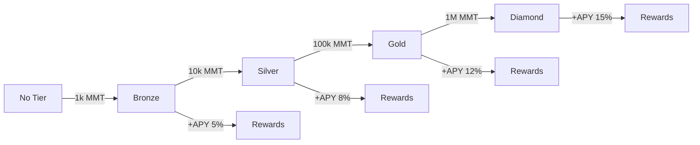

# MMT (Market Maker Token) Tokenomics

## Table of Contents
1. [Overview](#overview)
2. [Token Distribution](#token-distribution)
3. [Utility & Use Cases](#utility--use-cases)
4. [Staking & Rewards](#staking--rewards)
5. [Governance](#governance)
6. [Emission Schedule](#emission-schedule)
7. [Economic Model](#economic-model)
8. [Tier System](#tier-system)
9. [Bootstrap Phase](#bootstrap-phase)
10. [Long-term Sustainability](#long-term-sustainability)

## Overview

MMT (Market Maker Token) is the native utility and governance token of the Betting Platform. It serves multiple critical functions within the ecosystem:

- **Staking**: Earn rewards and unlock platform benefits
- **Governance**: Vote on protocol parameters and proposals
- **Utility**: Fee discounts, enhanced features, and tier benefits
- **Security**: Keeper stakes and market creator bonds

### Token Details
- **Token Name**: Market Maker Token
- **Symbol**: MMT
- **Decimals**: 6
- **Total Supply**: 1,000,000,000 MMT (1 billion)
- **Initial Circulating**: 150,000,000 MMT (15%)
- **Blockchain**: Solana (SPL Token)

## Token Distribution

### Initial Allocation

| Category | Allocation | Tokens | Vesting |
|----------|------------|--------|---------|
| Bootstrap Rewards | 10% | 100,000,000 | Immediate (2x multiplier) |
| Community Incentives | 25% | 250,000,000 | 5 years linear |
| Team & Advisors | 20% | 200,000,000 | 4 years, 1 year cliff |
| Investors | 15% | 150,000,000 | 3 years, 6 month cliff |
| Protocol Treasury | 15% | 150,000,000 | DAO controlled |
| Ecosystem Fund | 10% | 100,000,000 | 3 years |
| Liquidity Provision | 5% | 50,000,000 | Immediate |

### Visual Distribution

```
┌─────────────────────────────────────────────────────────┐
│                    MMT Distribution                      │
├─────────────────────────────────────────────────────────┤
│ Bootstrap (10%) ████                                    │
│ Community (25%) ██████████                              │
│ Team (20%)      ████████                                │
│ Investors (15%) ██████                                  │
│ Treasury (15%)  ██████                                  │
│ Ecosystem (10%) ████                                    │
│ Liquidity (5%)  ██                                      │
└─────────────────────────────────────────────────────────┘
```

## Utility & Use Cases

### 1. Trading Benefits

**Fee Discounts**:
- Bronze Tier: 10% discount
- Silver Tier: 20% discount
- Gold Tier: 30% discount
- Diamond Tier: 50% discount

**Leverage Access**:
- Bronze: Up to 25x
- Silver: Up to 50x
- Gold: Up to 75x
- Diamond: Up to 100x

**Priority Features**:
- Advanced order types
- API rate limit increases
- Priority customer support
- Early access to new markets

### 2. Market Creation

**Requirements**:
- Minimum 100,000 MMT stake to create markets
- Stake locked until market settlement
- Slash conditions for malicious behavior

**Benefits**:
- Earn 0.1% of all market volume
- Set custom fee tiers
- Market parameter control

### 3. Keeper Operations

**Staking Requirements**:
- Minimum: 10,000 MMT
- Recommended: 50,000+ MMT
- Slashing for failures

**Rewards**:
- Liquidation fees (1% of liquidated positions)
- Price update rewards (100 MMT per update)
- Performance bonuses

### 4. Governance Rights

**Voting Power**:
- 1 MMT = 1 vote
- Staked MMT gets 1.5x voting power
- Time-weighted voting (longer stake = more power)

**Governance Scope**:
- Protocol parameters
- Fee structures
- Treasury management
- Grant distribution
- Protocol upgrades

## Staking & Rewards

### Staking Mechanism

```solidity
// Staking rewards calculation
rewards = (stakeAmount * APY * timeStaked) / SECONDS_PER_YEAR

// With tier multiplier
totalRewards = rewards * tierMultiplier * performanceBonus
```

### Base APY Structure

| Tier | Min Stake | Base APY | Lock Bonus | Max APY |
|------|-----------|----------|------------|---------|
| Bronze | 1,000 | 5% | +2% (30d) | 7% |
| Silver | 10,000 | 8% | +3% (60d) | 11% |
| Gold | 100,000 | 12% | +4% (90d) | 16% |
| Diamond | 1,000,000 | 15% | +5% (180d) | 20% |

### Reward Sources

1. **Protocol Fees**: 30% of all protocol fees
2. **Liquidation Fees**: 20% of liquidation fees
3. **Inflation Rewards**: Decreasing emission schedule
4. **Treasury Yields**: DeFi yields on treasury

### Staking Example

```typescript
// Alice stakes 100,000 MMT for 90 days (Gold Tier)
const stakeAmount = 100_000 * 1e6; // 100k MMT
const baseAPY = 0.12; // 12%
const lockBonus = 0.04; // 4% for 90 days
const totalAPY = baseAPY + lockBonus; // 16%

const dailyRewards = (stakeAmount * totalAPY) / 365;
const quarterlyRewards = dailyRewards * 90;

// After 90 days: 100,000 * 0.16 * (90/365) = 3,945 MMT rewards
```

## Governance

### Governance Process

1. **Proposal Creation**:
   - Minimum 100,000 MMT required
   - 7-day discussion period
   - Proposal types: Parameter, Treasury, Upgrade

2. **Voting Period**:
   - 5-day voting window
   - Quorum: 10% of staked MMT
   - Approval: >50% for regular, >66% for critical

3. **Execution**:
   - 2-day timelock
   - Emergency DAO can expedite
   - Automatic execution after timelock

### Governance Examples

**Fee Adjustment Proposal**:
```yaml
Proposal: Reduce protocol fee
Current: 0.3%
Proposed: 0.25%
Rationale: Increase competitiveness
Quorum: 15% reached
Result: Approved (72% for, 28% against)
```

**Treasury Allocation**:
```yaml
Proposal: Fund keeper incentive program
Amount: 1,000,000 MMT
Duration: 6 months
Purpose: Increase keeper participation
Result: Approved (81% for)
```

## Emission Schedule

### Initial 5-Year Schedule

| Year | Inflation Rate | New Tokens | Cumulative Supply |
|------|---------------|------------|-------------------|
| 1 | 20% | 200,000,000 | 1,200,000,000 |
| 2 | 15% | 180,000,000 | 1,380,000,000 |
| 3 | 10% | 138,000,000 | 1,518,000,000 |
| 4 | 5% | 75,900,000 | 1,593,900,000 |
| 5 | 2.5% | 39,847,500 | 1,633,747,500 |

### Long-term Emission (Year 6+)
- Fixed 2% annual inflation
- 100% to staking rewards
- Adjustable via governance

### Emission Distribution

```
Year 1-2 Emissions:
├── 40% Staking Rewards
├── 30% Liquidity Mining
├── 20% Keeper Incentives
└── 10% Ecosystem Grants

Year 3+ Emissions:
├── 60% Staking Rewards
├── 20% Keeper Incentives
├── 15% Treasury
└── 5% Grants
```

## Economic Model

### Value Accrual Mechanisms

1. **Buy & Burn**:
   - 20% of protocol revenue used to buy back MMT
   - Burned tokens reduce supply
   - Deflationary pressure

2. **Fee Distribution**:
   - 30% to MMT stakers
   - 20% to liquidity providers
   - 20% to insurance fund
   - 20% buy & burn
   - 10% treasury

3. **Utility Demand**:
   - Market creation stakes
   - Keeper requirements
   - Tier benefits drive demand

### Revenue Projections

```typescript
// Projected annual revenue model
const assumptions = {
  dailyVolume: 10_000_000, // $10M
  avgFeeRate: 0.003, // 0.3%
  marketCount: 1000,
  keeperCount: 100,
};

const annualRevenue = {
  tradingFees: assumptions.dailyVolume * assumptions.avgFeeRate * 365,
  marketFees: assumptions.marketCount * 1000, // $1k per market/year
  keeperFees: assumptions.keeperCount * 5000, // $5k per keeper/year
  total: 11_445_000, // $11.445M
};

const mmtBuyback = annualRevenue.total * 0.20; // $2.289M
```

## Tier System

### Tier Requirements & Benefits

| Tier | MMT Required | Trading Fee | Max Leverage | API Rate | Voting Power |
|------|--------------|-------------|--------------|----------|--------------|
| Bronze | 1,000 | -10% | 25x | 1x | 1x |
| Silver | 10,000 | -20% | 50x | 2x | 1.2x |
| Gold | 100,000 | -30% | 75x | 5x | 1.5x |
| Diamond | 1,000,000 | -50% | 100x | 10x | 2x |

### Additional Tier Benefits

**Bronze**:
- Basic analytics
- Standard support
- Community access

**Silver**:
- Advanced analytics
- Priority support
- Beta features

**Gold**:
- Institutional tools
- Dedicated support
- Custom alerts
- API webhooks

**Diamond**:
- White-glove service
- Custom features
- Direct line to team
- Revenue sharing

### Tier Progression



## Bootstrap Phase

### 2x Rewards Multiplier

During the 30-day bootstrap phase:
- All MMT rewards have 2x multiplier
- Early participants get bonus allocation
- Vesting schedule: 25% immediate, 75% over 6 months

### Bootstrap Allocation

Total Bootstrap Pool: 100,000,000 MMT

Distribution based on contribution:
```
Tier 1 ($100-$1k): 1x multiplier → 10M MMT pool
Tier 2 ($1k-$10k): 1.1x multiplier → 20M MMT pool
Tier 3 ($10k-$100k): 1.2x multiplier → 30M MMT pool
Tier 4 ($100k+): 1.3x multiplier → 40M MMT pool
```

### Example Bootstrap Participation

```typescript
// Bob deposits $50,000 during bootstrap
const deposit = 50_000;
const tier = 3; // $10k-$100k tier
const tierMultiplier = 1.2;
const bootstrapMultiplier = 2.0;

const baseAllocation = (deposit / totalDeposits) * tierPoolSize;
const finalAllocation = baseAllocation * tierMultiplier * bootstrapMultiplier;

// If total tier 3 deposits = $10M, Bob's share = 0.5%
// Bob receives: 30M * 0.005 * 1.2 * 2 = 360,000 MMT
// Immediate: 90,000 MMT
// Vested: 270,000 MMT over 6 months
```

## Long-term Sustainability

### Deflationary Mechanisms

1. **Buy & Burn**: Continuous reduction in supply
2. **Slashing**: Bad actor penalties burned
3. **Lost Keys**: Natural deflation
4. **Governance Burns**: Community decisions

### Growth Drivers

1. **Network Effects**: More users → more value
2. **Keeper Network**: Decentralized infrastructure
3. **Cross-chain**: Expansion to other chains
4. **Institutional**: Professional trading tools

### Economic Security

```typescript
// Protocol security margins
const securityMetrics = {
  minStakedRatio: 0.3, // 30% of supply staked
  maxInflation: 0.02, // 2% annual max
  insuranceFundTarget: 0.1, // 10% of TVL
  slashingRate: 0.05, // 5% for violations
};

// Health check
const isHealthy = 
  (stakedSupply / totalSupply) >= securityMetrics.minStakedRatio &&
  currentInflation <= securityMetrics.maxInflation &&
  (insuranceFund / TVL) >= securityMetrics.insuranceFundTarget;
```

### Roadmap Impact

**Year 1**: Focus on adoption and liquidity
**Year 2**: Cross-chain expansion
**Year 3**: Institutional features
**Year 4**: Full decentralization
**Year 5+**: Self-sustaining ecosystem

## Risk Factors

### Economic Risks
- Market volatility affecting token price
- Competitive pressure on fees
- Regulatory changes

### Mitigation Strategies
- Diversified revenue streams
- Strong insurance fund
- Active governance
- Regular audits

## Conclusion

MMT tokenomics are designed to create a sustainable, value-accruing ecosystem that aligns all participants:

- **Traders** benefit from reduced fees and enhanced features
- **Stakers** earn rewards and governance rights
- **Keepers** receive compensation for maintaining the network
- **Market Creators** earn from successful markets
- **Long-term Holders** benefit from deflationary mechanics

The model emphasizes long-term sustainability over short-term gains, with mechanisms to ensure the protocol can thrive for decades.

---

*Note: Tokenomics are subject to change via governance. Always refer to the latest documentation and on-chain parameters.*