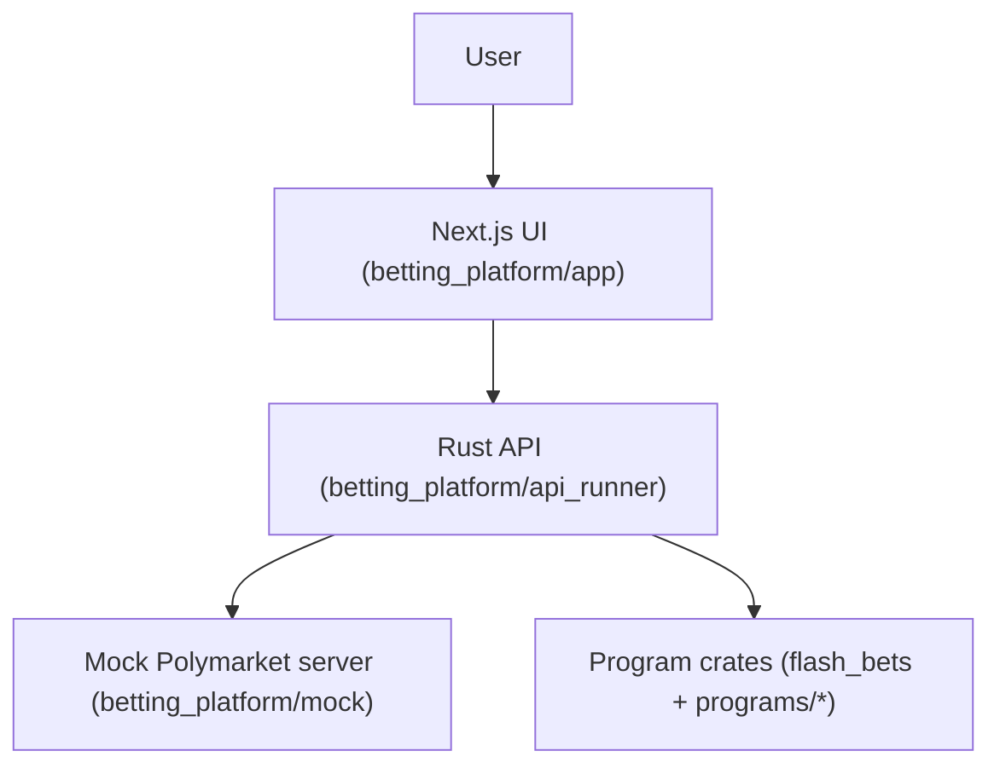

# Design: Make flashbets demo fully working end-to-end, with green CI and deployable on GitHub.

## Overview

Stabilize the existing multi-component stack by making configuration parsing deterministic (durations), ensuring middleware doesn’t fail when `ConnectInfo` is unavailable in tests, and enforcing CI quality gates. For demo-only “production”, external integrations run against a local mock server, while the flash-bets program compiles and its zk helpers are covered by unit tests.

## Architecture

### Component diagram (edit to match the codebase)

### Key components

- **UI**: markets and trading UX; demo wallet providers are client-only to avoid SSR issues.
- **API**: trading endpoints, health checks, mock integrations, and validation/middleware.
- **Mock server**: deterministic `/markets` and `/orders` responses for E2E.
- **Program crates**: unit-tested logic for flash-bets + related Solana-style programs.

## Data model / state

- Demo-only; no persistent DB required for the smoke flow. API uses in-memory/mocked stores where possible.

## Interfaces / APIs

- **UI → API**: fetch markets + submit order requests.
- **API → Mock**: Polymarket-like endpoints (`/markets`, `/orders`).
- **Errors**: surfaced as JSON error responses; `/health` must remain 200 in demo runs.

## File-level changes

| File | Action | Purpose |
|------|--------|---------|
| `betting_platform/api_runner/config/config.default.toml` | Modify | Use `humantime-serde` string durations |
| `betting_platform/api_runner/src/*middleware*.rs` | Modify | Accept optional `ConnectInfo` for test safety |
| `betting_platform/app/src/pages/_app.tsx` | Modify | Client-only Solana wallet providers |
| `.github/workflows/ci.yml` | Validate | Enforce Rust + UI + E2E smoke gates |

## Failure modes & error handling

- Missing `ConnectInfo` → middleware uses a safe fallback address → request still succeeds.
- Invalid duration config → TOML parsing fails fast → fixed by string durations in defaults.

## Edge cases

- Local runs in iCloud path may be flaky → prefer running E2E in CI; document constraints.

## Security & privacy

- Demo defaults use placeholder secrets; production config should use env vars for secrets.
- Logging redacts sensitive URLs (DB/Redis).

## Performance considerations

- Keep demo flow lightweight: mock server + single smoke test; avoid slow external calls.

## Test strategy

Map tests back to acceptance criteria.

- **Unit (Rust)**: `cargo test --locked` for `api_runner`, root workspace, and `flash_bets/program`.
- **UI checks**: `npm run lint`, `npm run type-check`, `npm run build`.
- **E2E**: Playwright smoke test executes UI trade flow against mock server + API.

## Rollout / migration plan (if needed)

- Push to GitHub repo `flashbets` and use GitHub Actions as the authoritative verifier for demo readiness.
